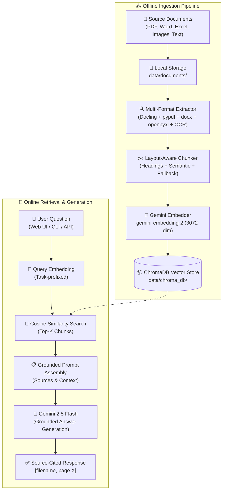

# Gemini-Powered RAG System (Proof of Concept)

A production-ready architecture for Document Intelligence and Retrieval-Augmented Generation (RAG), powered by **Google Gemini API** (`gemma-4-26b-a4b-it` as an efficient low-level model to prevent rate limits/quota exhaustion, with automatic fallback to `gemini-3-flash-preview`, `gemini-3.5-flash`, and `gemini-3.6-flash`, paired with `gemini-embedding-2` for 3072-dimensional embeddings) and **free local tools** for zero-cost operation during POC testing.

The system features a **FastAPI** backend, a modern **Dark-Mode Web UI** with glassmorphism aesthetics, an interactive **Terminal CLI**, and clean modular abstraction layers designed for seamless migration to **Microsoft Azure** when moving to production.

---

## Architecture Overview



---

## Features

- 📑 **Multi-Format Document Parsing**:
  - **PDF**: Layout-aware parsing preserving headings and tables via IBM Docling, with automatic `pypdf` fallback.
  - **Word (`.docx`)**: Structural hierarchy extraction via `python-docx` into Markdown.
  - **Excel (`.xlsx`)**: Multi-sheet extraction via `openpyxl` converting spreadsheets to Markdown tables.
  - **Images (`.png`, `.jpg`, `.jpeg`)**: Optical Character Recognition via Tesseract / PIL.
  - **Emails (`.eml`)**: RFC 822 MIME message extraction with headers (Subject, From, To, Date), body (plain text & HTML conversion), attachments summary, and recursive document content extraction for attached files (PDF, DOCX, XLSX, etc.).
  - **Plain Text / Markdown (`.txt`, `.md`)**: Native clean file ingestion.
- ✂️ **Intelligent Layout-Aware Chunking**:
  - Respects section headers (`#`, `##`, `###`) to preserve context.
  - Automatic recursive text splitting for oversized sections.
  - Token cap enforcement via `tiktoken` with character-based approximation fallbacks.
  - Preserves tables as atomic units.
- 🧮 **Asymmetric Gemini Embeddings**:
  - Uses `gemini-embedding-2` (3072 dimensions) with specialized retrieval task prefixes:
    - Document chunks: `title: {heading} | text: {content}`
    - Queries: `task: question answering | query: {question}`
  - Exponential backoff and rate-limited batching.
- 📦 **Local Persistent Vector Store**:
  - Powered by ChromaDB with cosine distance indexing.
  - Metadata indexing: `file_name`, `page_number`, `section_heading`, `chunk_index`, and `token_count`.
- 💬 **Modern Web UI**:
  - Glassmorphism dark-theme chat interface (`index.html`).
  - Drag-and-drop document upload and management dashboard (`documents.html`).
  - Source citation chips referencing specific documents and page numbers.
  - Real-time system metrics (documents indexed, chunks stored, active models).
- 💻 **Terminal CLI**: Interactive console powered by `rich` with colored tables, status panels, and live markdown streaming.
- 🧪 **Automated Test Suite**: 30 comprehensive unit and integration tests passing with `pytest`.
- ☁️ **Azure Ready**: Fully decoupled architecture matching 1:1 with Azure AI services (Blob Storage, Document Intelligence, Azure AI Search, Azure OpenAI).

---

## Project Structure

```
c:\MyProjects\RAG\
├── .env                            # Local environment variables (GEMINI_API_KEY)
├── .env.example                    # Configuration template
├── .gitignore
├── pyproject.toml                  # Python package configuration & dependencies
├── README.md                       # Main project documentation
│
├── configs/
│   └── settings.py                 # Centralized Pydantic settings
│
├── src/
│   ├── __init__.py
│   │
│   ├── ingestion/                  # ── INGESTION PIPELINE ──
│   │   ├── __init__.py
│   │   ├── file_manager.py         # Filesystem scanner & manifest tracking
│   │   ├── document_processor.py   # Multi-format parsers (PDF, DOCX, XLSX, OCR, TXT)
│   │   ├── chunker.py              # Layout-aware & semantic chunking engine
│   │   ├── embedder.py             # Gemini API embedding client
│   │   ├── indexer.py              # ChromaDB vector store client
│   │   └── pipeline.py             # End-to-end ingestion orchestrator
│   │
│   ├── retrieval/                  # ── RETRIEVAL & GENERATION ──
│   │   ├── __init__.py
│   │   ├── search_client.py        # Vector similarity search
│   │   ├── query_engine.py         # RAG query execution & citations
│   │   └── prompts.py              # System prompts & grounding templates
│   │
│   ├── api/                        # ── FASTAPI APPLICATION ──
│   │   ├── __init__.py
│   │   ├── main.py                 # FastAPI server (serves API & static Web UI)
│   │   ├── models.py               # Pydantic request & response schemas
│   │   └── routes/
│   │       ├── ingest.py           # POST /api/ingest, GET/DELETE /api/documents
│   │       └── query.py            # POST /api/query
│   │
│   └── cli.py                      # Rich terminal CLI
│
├── web/                            # ── WEB UI STATIC ASSETS ──
│   ├── index.html                  # Chat interface
│   ├── documents.html              # Document management & upload
│   ├── css/
│   │   └── styles.css              # Dark mode & glassmorphism styling
│   └── js/
│       ├── app.js                  # Chat interaction & citation chips
│       └── documents.js            # File upload & document management logic
│
├── data/
│   ├── documents/                  # Document drop directory
│   └── chroma_db/                  # ChromaDB persistent vector database
│
├── scripts/
│   └── generate_sample_data.py     # Script to generate sample Word & Excel docs
│
├── tests/                          # ── AUTOMATED TEST SUITE ──
│   ├── test_api.py                 # FastAPI endpoint tests
│   ├── test_chunker.py             # Chunking & splitting tests
│   ├── test_file_manager.py        # File scanner & manifest tests
│   ├── test_indexer.py             # ChromaDB indexer tests
│   ├── test_models.py              # Pydantic schema validation tests
│   ├── test_pipeline.py            # End-to-end pipeline test
│   ├── test_processor.py           # Parser & table converter tests
│   └── test_prompts.py             # Prompt formatting & context tests
│
└── docs/                           # ── DETAILED DOCUMENTATION ──
    ├── architecture.md             # System architecture & component design
    ├── api_reference.md            # REST API endpoints, schemas & curl examples
    └── azure_migration.md          # Guide for migrating from POC to Azure
```

---

## Quickstart Guide

### 1. Prerequisites
- **Python 3.11+** (Tested on Python 3.14 on Windows)
- **Google Gemini API Key** (Free tier from [Google AI Studio](https://aistudio.google.com))
- *(Optional)* **Tesseract OCR** (Only required if OCR on scanned images is needed)

### 2. Installation
Clone the repository and set up a Python virtual environment:

```powershell
cd c:\MyProjects\RAG

# Create virtual environment
python -m venv .venv

# Activate virtual environment
.venv\Scripts\activate

# Install dependencies
pip install -e .
```

### 3. Configure API Key
Create a `.env` file in the root directory:

```powershell
Set-Content -Path ".env" -Value "GEMINI_API_KEY=your_actual_gemini_api_key"
```

You can customize additional settings in `.env` if desired:

```env
GEMINI_API_KEY=your_actual_gemini_api_key
GEMINI_EMBED_MODEL=gemini-embedding-2
GEMINI_LLM_MODEL=gemma-4-26b-a4b-it
GEMINI_LLM_FALLBACK_MODELS=gemini-3-flash-preview,gemini-3.5-flash,gemini-3.6-flash
DOCUMENTS_DIR=./data/documents
CHROMA_DB_DIR=./data/chroma_db
MAX_CHUNK_TOKENS=500
TOP_K_RESULTS=5
TEMPERATURE=0.2
```

---

## Running the System

### Option A: Launch the Web UI

Start the FastAPI application with Uvicorn:

```powershell
.venv\Scripts\python.exe -m uvicorn src.api.main:app --reload --host 127.0.0.1 --port 8000
```

Open your browser to:
- **Chat Interface**: [http://127.0.0.1:8000/](http://127.0.0.1:8000/)
- **Document Management**: [http://127.0.0.1:8000/documents](http://127.0.0.1:8000/documents)
- **Interactive Swagger Docs**: [http://127.0.0.1:8000/docs](http://127.0.0.1:8000/docs)

### Option B: Interactive Terminal CLI

Run the interactive terminal CLI:

```powershell
.venv\Scripts\python.exe -m src.cli
```

Available commands within the CLI:
- `ingest` — Ingest all pending documents in `data/documents/`
- `ingest --force` — Re-ingest all documents regardless of manifest
- `status` — Show indexed file counts, total chunks, and active models
- `clear` — Wipe the ChromaDB collection
- Any natural language question — Generates a grounded response with citations

---

## Ingesting Documents

You can ingest documents in three ways:

1. **Via Web UI**: Navigate to [http://127.0.0.1:8000/documents](http://127.0.0.1:8000/documents) and drag & drop your files into the upload area.
2. **Via Drop Directory**: Copy `.pdf`, `.docx`, `.xlsx`, `.png`, `.jpg`, `.txt`, `.md`, or `.eml` files directly into `data/documents/`, then click **⚡ Process All Pending** in the UI or run `ingest` in the CLI.
3. **Via REST API**:
   ```bash
   curl -X POST http://127.0.0.1:8000/api/ingest \
        -F "files=@path/to/document.pdf"
   ```

---

## Testing & Quality Assurance

Run the automated test suite with pytest:

```powershell
.venv\Scripts\python.exe -m pytest tests/ -v
```

All 30 unit and integration tests validate:
- Fast API routes and static asset serving
- Layout-aware markdown splitting and chunk enrichment
- Local file scanning, stat calculations, and manifest updates
- ChromaDB persistence, cosine search, and deletion by source
- Pydantic models and request/response validation
- Grounded prompt construction and source attribution
- Multi-format extraction (tables, text, markdown, error cases)

---

## Further Documentation

- [System Architecture Deep Dive](docs/architecture.md) — Comprehensive technical architecture, pipelines, and design decisions.
- [REST API Reference](docs/api_reference.md) — Full endpoint specifications, parameters, payloads, and response examples.
- [Azure Migration Guide](docs/azure_migration.md) — Step-by-step instructions for graduating this POC to Azure AI Search & Azure OpenAI.
