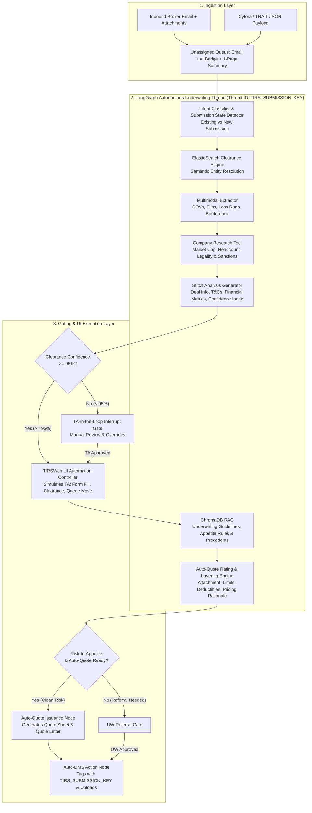
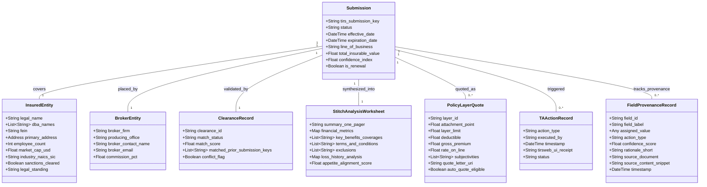
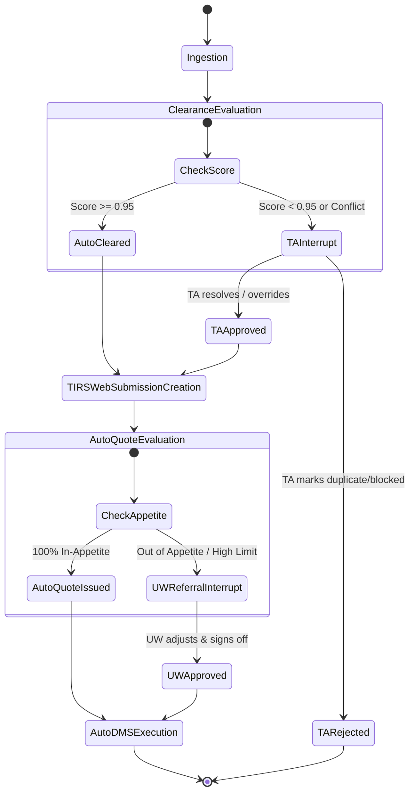

# Product Requirements Document (PRD)
## Project: TIRSWeb AI-Native Intelligent Underwriting Platform
**Version:** 1.0.0  
**Target Environment:** LangGraph Agentic Framework | ElasticSearch Clearance | ChromaDB RAG | TIRSWeb UI Automation  
**Author:** AI Architecture & Underwriting Modernization Team  
**Status:** Ready for Injection / Implementation  

---

## 1. Executive Summary & Vision

### 1.1 Problem Statement
Commercial insurance underwriting currently relies on labor-intensive Technical Assistant (TA) and Underwriter (UW) manual workflows:
- Extracting unstructured submission emails and broker attachments (SOVs, Slips, Loss Runs).
- Manually verifying clearance in legacy databases (TIRSWeb / Informix) to prevent broker double-brokering or conflicts.
- Manually keying in deal terms, performing company research (sanctions, market cap, employee headcount), and drafting stitch analysis sheets.
- Manually calculating layering, pricing, terms & conditions (T&Cs), and issuing quote letters.
- Manually uploading files and moving tasks between queues (Unassigned → Assigned → DMS).

### 1.2 Proposed Solution
The **TIRSWeb AI-Native Intelligent Underwriting Platform** is an autonomous multi-agent platform orchestrated via **LangGraph**. It transforms TIRSWeb into a fully autonomous, self-driving underwriting engine:
1. **Zero-Touch Clearance & Submission Creation**: Submissions with confidence scores $\ge 95\%$ are cleared and created directly in TIRSWeb via autonomous UI actions; ambiguous submissions ($< 95\%$) are routed to an interactive TA-in-the-loop gate.
2. **Autonomous Auto-Quote**: Clean, in-appetite commercial submissions are priced, layered, and quoted end-to-end without human intervention, generating bound quote sheets and formal quote letters.
3. **Automated Technical Assistant (Auto-DMS & Queue Routing)**: Automated email classification, 1-page underwriting summaries, Cytora/TRAIT attribute mapping, TO/CC recipient queue routing, and automated document storage in TIRSWeb DMS.

---

## 2. System Architecture & High-Level Flow



---

## 3. Core Features: Current State vs. AI-Native Future State

### 3.1 Current State Context
Currently, all incoming emails land in the **UnAssigned Queue**. These emails are manually segregated, classified, and assigned by a Technical Assistant (TA) to a department-specific **Assigned Queue**. 
- **Action Item 1 - Submission / Clearance Input**: Cytora parses the email into a JSON schema containing underwriting information. The TA creates a submission based on this JSON.
- **Clearance**: TAs manually map current submissions to historical submissions (prior insured by the reinsurance company or similar insurants) for full visibility.
- **Underwriter Workbench**: Underwriters view Reserved/Cleared submissions in their Assigned Queue. They rely on manual Excel-generated **Underwriting Rationale Worksheets** (risk, trade-offs, decision matrix, financial justification) which are reviewed and approved by a senior underwriter based on policy limits.
- **Quote Process**: The system-generated Quote (Authorization Letter) is sent to brokers/cedants and manually attached to the submission in a separate **Document Management System (DMS)** as an archive document for future reference.

### 3.2 Future State: AI-Native Intelligent Underwriting Platform
The future state enables end-to-end autonomous underwriting, with human-in-the-loop (HITL) checkpoints to validate critical decisions and reduce errors.

#### Feature 1: 1-Page Summary Feature
Every incoming email that lands in the UnAssigned queue is parsed and stored in the **TIRSWeb RAG** (a centralized RAG store for future LLM inference and critical decision making).
- **Extraction & Summarization**: All underwriting information is extracted. Alongside the existing TRAIT/Cytora JSON extraction, a **1-Page Summary** document is generated. This allows the underwriter to review email contents at a glance without opening the raw email.
- **Email Categorization**:
  - **SUBMISSION email**: Contains attachments from cedants/brokers for a new business, resulting in a new submission creation.
  - **Follow-up emails**: Emails to be attached as a DMS document under an existing submission.

#### Feature 2: Auto Create Submission + Auto Clearance
- **Ingestion & Assignment**: Incoming "SUBMISSION" emails land in the UnAssigned Queue (displaying Email + AI icon + 1-Page Summary) alongside a new **Stitch App Analysis Worksheet** (replacing manual Underwriting Rationale Worksheets).
- **Auto-Routing**: The system extracts `TO` / `CC` addresses, maps them to the respective UW or TA, and auto-assigns items from the UnAssigned Queue to the Assigned Queue.
- **Intent Mapping**: The LLM reviews the email, decides it is a new submission, and auto-maps it to the **[Submission/Clearance Input]** TA Action.
- **TA Action Loop (TA Assist)**: If the TA is unsatisfied with the assigned action, they can question the reasoning via a chat window with **TA Assist** (an intelligent agent). TA Assist justifies the action using email evidence. If requested, TA Assist adjusts the respective TA Actions in case of any error and notes the changes.
- **Auto Create & Fill**: The new submission template is automatically filled based on the TRAIT/Cytora JSON.
- **Semantic Auto Clearance**: Replacing manual or fuzzy-logic name matching, the system uses semantic entity resolution to associate the newly created submission with historical submissions based on governed rules and name matching rules.

#### Feature 3: Auto Quote
- **Pending Authorization Group**: Underwriters see a new status group in the Underwriting Workbench called **"Pending Authorization"**, which displays all submissions auto-quoted by **UW Assist** (the intelligent underwriter agent).
- **Stitch Analysis Integration**: The Deal Info and Terms & Conditions tabs are automatically filled based on the Stitch Analysis Worksheet, making a new Quote ready for Underwriter Review.
- **Quote Summary**: A specialized 1-page summary explains UW Assist's reasoning for populating policy details, premium selection, brokerage/commission selection, installment scheme, and T&Cs.
- **Quote Loop (UW Assist)**: An interactive back-and-forth chat between the Underwriter and UW Assist to set the right information in the Quote and the reasoning for selection. UW Assist auto-adjusts based on risk factors, leveraging the TIRSWeb RAG database and the Stitch Analysis sheet to quote according to the underwriter's risk appetite.

#### Feature 4: Auto Archive DMS (Automating TA Actions)
- **Contextual Attachment**: The moment follow-up emails land in the UnAssigned queue, TA Assist maps the email (constituting of email and TRAIT/Cytora JSON) to the specific submission key and identifies it as a Follow-Up email.
- **Auto-Archiving**: TA Assist moves the UnAssigned item to the respective Assigned TA and automatically archives the document into the DMS. The Document Type, Document Name, and Document Description are all inferred using the incoming email.
- **TA Auto DMS Loop**: If the TA is unhappy with the allocation, they can assign a specific action, and TA Assist will take the respective TA action based on TA feedback.

---

## 4. Domain Ontology & Entity Models



---

## 5. LangGraph Agent Architecture & State Machine

### 5.1 LangGraph State Schema (`UnderwritingState`)

```python
from typing import Annotated, Dict, List, Optional, Any
from typing_extensions import TypedDict
import operator

class UnderwritingState(TypedDict):
    # Core Identifiers
    tirs_submission_key: str                     # LangGraph Thread ID & TIRS Primary Key
    is_existing_submission: bool                 # True if update to existing deal
    email_id: str
    
    # Ingestion Payloads
    email_raw: Dict[str, Any]                    # From, To, CC, Subject, Body, Timestamp
    cytora_json: Dict[str, Any]                  # Pre-parsed ingestion payload from Cytora/TRAIT
    raw_attachment_paths: List[str]              # Paths to PDF, XLSX, DOCX attachments
    
    # Extraction & Enrichment
    multimodal_extractions: Dict[str, Any]       # Extracted SOV tables, loss runs, slip terms
    company_research: Dict[str, Any]             # Employees, market cap, legal/sanction status
    stitch_worksheet: Dict[str, Any]             # Merged analysis sheet & 1-page summary
    
    # Clearance & ElasticSearch
    clearance_status: str                        # "CLEARED", "CONFLICT", "AMBIGUOUS", "TA_REVIEW"
    clearance_confidence: float                  # 0.0 to 1.0 (Threshold: 0.95)
    matched_submission_keys: List[str]
    
    # RAG & Auto-Quote
    underwriting_appetite_fit: Dict[str, Any]    # ChromaDB query result (rules, class appetite)
    quote_layers: List[Dict[str, Any]]           # Attachment, Limit, Deductible, Premium
    quote_letter_content: str                    # Markdown/HTML rendered formal quote letter
    auto_quote_approved: bool                    # Flag indicating zero-touch quote execution
    
    # Execution & UI Automation
    assigned_queue: str                          # Mapped UW/TA queue
    ta_actions_pending: List[str]                # ["ATTACH_DMS", "CREATE_SUBMISSION", "AUTO_QUOTE"]
    ta_actions_completed: List[Dict[str, Any]]   # Execution receipts and UI logs
    
    # Field-Level Explainability & Provenance (UI Tooltip / AI Hover)
    field_provenance: Dict[str, Dict[str, Any]]  # Maps field_id -> {value, action, rationale, source_doc, snippet, confidence}

    # Auditing & Traceability
    audit_trail: Annotated[List[str], operator.add]
    error_messages: Annotated[List[str], operator.add]
```

### 5.2 LangGraph Node Responsibilities

| Node Name | Input State Attributes | Operation | Output State Attributes |
| :--- | :--- | :--- | :--- |
| `email_ingestion_node` | `email_raw`, `cytora_json` | Generates 1-page summary; resolves To/CC to UW queue; classifies action intent. | `stitch_worksheet["summary"]`, `assigned_queue`, `ta_actions_pending` |
| `clearance_es_node` | `cytora_json`, `email_raw` | Calls ElasticSearch endpoint; computes entity similarity; checks conflict rules. | `clearance_status`, `clearance_confidence`, `matched_submission_keys` |
| `multimodal_extractor_node` | `raw_attachment_paths` | Runs Multimodal extraction on SOV tables, slips, and 5-year loss runs. | `multimodal_extractions` |
| `company_enrichment_node` | `insured_name`, `address` | Queries free public web APIs (employees, market cap, legal status, news/sanctions). | `company_research` |
| `stitch_synthesis_node` | Extracted + Enriched states | Merges deal terms, calculates overall submission confidence index. | `stitch_worksheet`, `clearance_confidence` |
| `clearance_gate` | `clearance_confidence` | Conditional branch: If $\ge 0.95 \to$ `tirsweb_submission_create_node`; else $\to$ `ta_review_interrupt`. | (Conditional Routing) |
| `tirsweb_ui_executor_node` | `tirs_submission_key`, `stitch_worksheet` | Headless UI automation creates submission in TIRSWeb, sets clearance, moves queue. | `ta_actions_completed` |
| `underwriting_rag_node` | `stitch_worksheet` | Queries ChromaDB for guidelines, line capacity, appetite fit, pricing formulas. | `underwriting_appetite_fit` |
| `auto_quote_engine_node` | `stitch_worksheet`, `underwriting_appetite_fit` | Computes layering, gross premium, exclusions, subjectivities; generates quote letter. | `quote_layers`, `quote_letter_content`, `auto_quote_approved` |
| `auto_dms_node` | All generated artifacts | Packages email, JSON, stitch worksheet, quote letter; uploads to TIRSWeb DMS. | `ta_actions_completed`, `audit_trail` |

---

## 6. Functional Specifications

### 6.1 ElasticSearch Semantic Clearance Specification
- **Endpoint Request Payload**:
  ```json
  {
    "query": {
      "bool": {
        "should": [
          { "fuzzy": { "insured_name": { "value": "Acme Logistics LLC", "fuzziness": "AUTO" } } },
          { "match_phrase": { "tax_id": "12-3456789" } },
          { "term": { "normalized_domain": "acmelogistics.com" } }
        ],
        "minimum_should_match": 1
      }
    }
  }
  ```
- **Scoring & Conflict Resolution Logic**:
  - Score $\ge 0.95$:
    - If prior record belongs to *same broker* $\to$ Flagged as **Renewal / Endorsement Update** $\to$ Auto-attach to existing `TIRS_SUBMISSION_KEY`.
    - If no prior record found $\to$ Flagged as **Clean New Account** $\to$ Auto-create new `TIRS_SUBMISSION_KEY`.
    - If prior record belongs to *different broker* within clearance window $\to$ Flagged as **Broker Conflict** $\to$ Route to TA with Conflict Notice.
  - Score $< 0.95$:
    - Route to TA Review queue with top 3 ElasticSearch candidate matches and highlight diffs.

### 6.2 Multimodal Document Extraction & Stitch Analysis Worksheet
The Stitch Analysis Worksheet consolidates four distinct data feeds into an immutable underwriting artifact:
1. **Cytora / TRAIT JSON**: Pre-parsed standard attributes (Insured, Effective Date, Line of Business).
2. **Multimodal Attachment Parser**:
   - **SOV (Schedule of Values)**: Total Insurable Value (TIV), location count, construction types, protection classes, flood/quake zones.
   - **Loss Runs**: 5-year historical loss frequency, loss severity, open vs. closed claims, total incurred loss ratio.
   - **Slip / Wording**: Attachment point, requested limit, current carrier, broker commission.
3. **Public Web Enrichment**:
   - Market capitalization (USD) / annual revenue bracket.
   - Total employee headcount.
   - Legality check: OFAC sanctions check, active litigation, OSHA/regulatory penalties.
4. **Appetite Alignment**:
   - ChromaDB similarity score against company's target commercial appetite.

#### Output Schema: Stitch Analysis Worksheet
```json
{
  "tirs_submission_key": "SUB-2026-09821",
  "account_overview": {
    "insured_name": "Apex Global Freight Corp",
    "dba": "Apex Freight",
    "fein": "98-7654321",
    "headquarters": "Chicago, IL, USA",
    "market_cap_usd": "420000000",
    "employee_count": 1850,
    "sanctions_legal_status": "CLEARED"
  },
  "deal_metrics": {
    "line_of_business": "Commercial Inland Marine & Cargo",
    "total_insurable_value": 75000000.0,
    "effective_date": "2026-11-01",
    "expiration_date": "2027-11-01",
    "requested_limit": 10000000.0,
    "requested_attachment": 0.0,
    "target_premium": 185000.0
  },
  "loss_history_5yr": {
    "total_incurred": 142000.0,
    "total_claims_count": 3,
    "loss_ratio_pct": 15.4,
    "large_loss_flag": false
  },
  "underwriting_evaluation": {
    "appetite_fit": "STRONG_FIT",
    "confidence_index": 0.98,
    "auto_quote_recommended": true
  }
}
```

### 6.3 Auto-Quote Engine Specification
- **Appetite Validation Rules (ChromaDB)**:
  - TIV within authorized treaty capacity ($\le \$100M$).
  - 5-year loss ratio $< 35\%$.
  - No high-hazard exclusions (e.g. hazardous chemical transport, sanctions).
- **Pricing & Layer Model**:
  - Primary or Excess layer structuring:
    $$\text{Layer Premium} = \text{Limit} \times \text{Rate on Line (ROL)} \times \text{Hazard Factor}$$
- **Zero-Touch Execution**:
  - Generate bound quote record in TIRSWeb.
  - Automatically compose formal **Quote Letter** containing:
    - Named Insured & Producing Broker details
    - Quoted Layer (e.g. $\$5,000,000$ Part of $\$10,000,000$ Excess of $\$5,000,000$)
    - Premium, Minimum Earned Premium, Taxes & Surcharges
    - Subjectivities (e.g., "Subject to favorable inspection within 30 days of binding")
    - Exclusions and standard policy forms schedule
  - Publish to TIRSWeb UI and prepare email draft for broker.

### 6.4 TIRSWeb UI Automation Controller (Agent Persona)
Since Informix DB is restricted to UI access, the agent embeds an autonomous **UI Controller (Playwright-based)**:
- **Authentication**: Authenticates as designated system agent user `SVC_AI_UNDERWRITER`.
- **Navigation & Form Automation**:
  - `navigate_to_submission_module()`
  - `fill_submission_master(state.stitch_worksheet)`
  - `trigger_ui_clearance_confirm(state.clearance_status)`
  - `attach_dms_files(state.tirs_submission_key, [email, pdf, worksheet])`
  - `move_queue(from_queue="Unassigned", to_queue=state.assigned_queue)`
  - `post_quote_record(state.quote_layers)`
- **Error Recovery**: Full screenshot capture, DOM failure logging, and graceful handoff to TA queue if UI encounters modal dialog errors or field validation errors.

### 6.5 Field-Level AI Provenance, Badging & Hover Tooltips (Explainability Engine)

To establish complete transparency and trust with Technical Assistants and Underwriters, every field populated or modified by the agent in TIRSWeb (and within the Stitch Analysis Worksheet) carries fine-grained **provenance and rationale metadata**.

#### 6.5.1 UI/UX Interaction Design
1. **Field-Level AI Badge / Icon**:
   - Every input field, dropdown, toggle, or numerical cell populated by the agent displays a distinct **AI Sparkle Icon (`[✨ AI]`)** immediately adjacent to the field label or control.
2. **Hover Popover / Tooltip**:
   - When a TA or Underwriter hovers over the `[✨ AI]` icon, an interactive, non-blocking glassmorphic popover appears showing:
     - **Action Taken**: `AUTO_POPULATED`, `NORMALIZED`, `INFERRED`, `CALCULATED`, or `DEFAULTED`.
     - **Confidence Rating**: Visual pill badge (e.g., `🟢 98% High Confidence`).
     - **Action Rationale (Why)**: A concise 1–2 sentence human-readable explanation of why this specific action/value was chosen.
     - **Grounding Source & Evidence Snippet (Based on What)**: The exact source artifact and contextual excerpt from which the value was derived (e.g., email text line, Cytora JSON path, or specific spreadsheet cell).
     - **Timestamp & Agent Persona**: Execution timestamp and agent version.
3. **Interactive Override Tracking**:
   - If a TA or UW manually edits a field that was populated by AI, the icon dynamically transitions to a `[✏️ Overridden]` badge.
   - The original AI value, reason, and user replacement value are captured in the immutable audit log for model alignment and retraining.

#### 6.5.2 Hover Popover Visual Wireframe
```
┌────────────────────────────────────────────────────────────────────────┐
│ Total Insurable Value (TIV)  [$ 75,000,000      ] [✨ AI]              │
│                                                   │                    │
│                        ┌──────────────────────────┴───────────────────┐│
│                        │ ✨ AI Action: AUTO_POPULATED  [🟢 99% Conf]   ││
│                        ├──────────────────────────────────────────────┤│
│                        │ Why: Extracted location total from insured's ││
│                        │ latest Schedule of Values (SOV) summary row. ││
│                        ├──────────────────────────────────────────────┤│
│                        │ Grounding Evidence:                          ││
│                        │ 📄 Document: SOV_Chicago_Locations_2026.xlsx ││
│                        │ 📍 Cell: Sheet1!E42 (Grand Total TIV)        ││
│                        │ 💬 Raw Snippet: "$75,000,000.00 USD"         ││
│                        ├──────────────────────────────────────────────┤│
│                        │ ⏱️ 2026-09-26 00:15:32 | Agent: v1.0.0-PROD  ││
│                        └──────────────────────────────────────────────┘│
└────────────────────────────────────────────────────────────────────────┘
```

#### 6.5.3 Field Provenance Data Contract (`FieldProvenanceRecord`)
```json
{
  "tirs_submission_key": "SUB-2026-09821",
  "field_id": "total_insurable_value",
  "field_label": "Total Insurable Value (TIV)",
  "assigned_value": 75000000.0,
  "action_type": "AUTO_POPULATED",
  "confidence_score": 0.99,
  "rationale_short": "Aggregated Grand Total insurable values across 12 commercial warehouse locations from Schedule of Values.",
  "grounding": {
    "source_type": "ATTACHMENT_SPREADSHEET",
    "source_name": "SOV_Chicago_Locations_2026.xlsx",
    "location_reference": "Sheet1!E42",
    "content_snippet": "Total Insured Property Values: $75,000,000.00"
  },
  "audit_metadata": {
    "agent_version": "v1.0.0-PROD",
    "timestamp": "2026-09-26T00:15:32.412Z",
    "user_overridden": false,
    "user_override_value": null
  }
}
```

#### 6.5.4 TIRSWeb UI Integration Strategy
- **DOM Metadata Injection**: When the UI Automation Controller fills TIRSWeb forms via Playwright/script injection, it attaches a `data-ai-provenance` HTML5 attribute containing the serialized `FieldProvenanceRecord` JSON.
- **Frontend Script Hook**: A lightweight client-side script in TIRSWeb listens to mouseover events on `[data-ai-provenance]` elements to render the tooltip popup without requiring backend re-queries.

---

## 7. Knowledge Base (ChromaDB) & Research Tools

### 7.1 ChromaDB Collection Architecture
1. `collection_uw_guidelines`:
   - Underwriting appetite manuals, line capacity rules, authority matrices.
   - Metadata: `lob`, `state`, `min_attachment`, `max_limit`, `effective_year`.
2. `collection_policy_wordings`:
   - Standard endorsements, exclusion clauses, manuscript conditions.
3. `collection_historical_quotes`:
   - Historical winning quotes and precedent pricing for similar risk profiles.

### 7.2 Company Research Tool Stack (Zero-Cost / Open APIs)
- **Web Search & Financials**: DuckDuckGo Search API / Yahoo Finance API for market cap, ticker, and employee statistics.
- **Corporate Registry**: OpenCorporates / SEC EDGAR for legal filings, subsidiaries, and corporate identity verification.
- **Sanctions & Compliance**: Consolidated US Treasury OFAC SDN and CSL search for instant sanction screening.

---

## 8. HITL (Human-in-the-Loop) & Exception Handling



### LangGraph Checkpointing & Interrupt Configuration
- **Checkpointer**: Persistent Sqlite/PostgreSQL checkpointer using thread ID `tirs_submission_key`.
- **Interrupts**:
  ```python
  if state["clearance_confidence"] < 0.95:
      # Interrupts LangGraph execution and pauses thread
      interrupt({
          "type": "TA_CLEARANCE_APPROVAL_REQUIRED",
          "candidates": state["matched_submission_keys"],
          "confidence": state["clearance_confidence"],
          "message": "Clearance confidence is below 95%. Please review and confirm."
      })
  ```

---

## 9. Non-Functional & Security Requirements

1. **Auditability & Traceability**:
   - Every autonomous decision (Clearance, Auto-Quote, DMS update) must record the prompt version, model ID, raw tool inputs, and decision rationale in `audit_trail`.
2. **Data Privacy & PII Handling**:
   - Redact SSNs and personal financial information before external web enrichment queries.
3. **Resilience & SLA**:
   - Email Ingestion to 1-Page Summary: $< 30$ seconds.
   - End-to-End Auto-Clearance & TIRSWeb Submission creation: $< 90$ seconds.
   - Autonomous Auto-Quote generation: $< 120$ seconds.
4. **Idempotency**:
   - Re-running the agent thread with the same `tirs_submission_key` must update the existing deal without duplicating submission records or DMS attachments.

---

## 10. Step-by-Step Implementation Roadmap

| Phase | Milestone | Deliverables |
| :--- | :--- | :--- |
| **Phase 1** | **Ontology & Core State Machine** | Define Pydantic models, TypedDict state, LangGraph graph topology with mock nodes. |
| **Phase 2** | **Clearance & ElasticSearch Integration** | Implement ElasticSearch query builder, entity matching algorithm, and $0.95$ threshold branching logic. |
| **Phase 3** | **Multimodal Extraction & Stitch Worksheet** | Implement multimodal document extractor for SOVs, loss runs, and slips; synthesize 1-page summary and Stitch sheet. |
| **Phase 4** | **Company Research & ChromaDB RAG** | Implement free corporate search tools (market cap, employees, legality); initialize ChromaDB collections for UW appetite. |
| **Phase 5** | **Autonomous Quote Engine** | Implement pricing and layering logic; automated quote letter renderer; zero-touch quote execution. |
| **Phase 6** | **TIRSWeb UI Automation (Playwright)** | Build automated browser controller to execute TA actions: form filling, clearance confirmation, DMS attachment, queue transitions. |
| **Phase 7** | **End-to-End Evaluation & PoC Injection** | Run full regression against 50 real broker submissions; validate clearance accuracy and auto-quote safety. |
