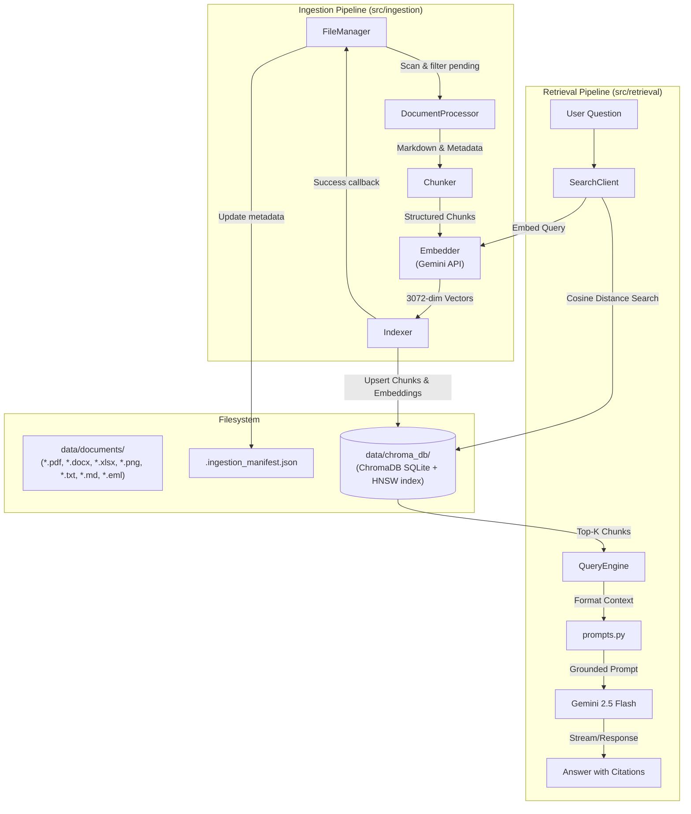
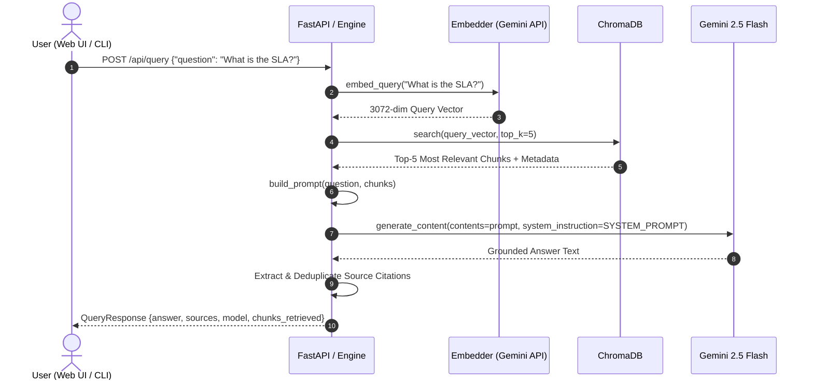

# System Architecture Deep Dive

This document details the architectural design, component interactions, data pipelines, and design patterns implemented in the Gemini RAG System POC.

---

## 1. High-Level Architecture

The system is split into two primary operational phases:
1. **Offline Ingestion Pipeline**: Asynchronously or batch parses documents, creates structural layout-aware chunks, embeds content via Gemini, and indexes vectors into ChromaDB.
2. **Online Retrieval & Generation Pipeline**: Processes user queries, executes semantic vector similarity search against ChromaDB, builds a grounded context prompt, and generates a factual, cited response via `gemini-2.5-flash`.

---

## 2. Ingestion Pipeline Details

The ingestion workflow is managed by [src/ingestion/pipeline.py](file:///c:/MyProjects/RAG/src/ingestion/pipeline.py) and coordinates 5 specialized components:

### 2.1 File Manager (`file_manager.py`)
- **Responsibility**: Scans `data/documents/` recursively for supported extensions (`.pdf`, `.docx`, `.xlsx`, `.png`, `.jpg`, `.jpeg`, `.txt`, `.md`, `.eml`).
- **State Tracking**: Maintains `.ingestion_manifest.json` in the documents directory. Each entry tracks:
  - `ingested` (bool)
  - `ingested_at` (ISO timestamp)
  - `modified_at` (File modification timestamp)
  - `chunk_count` (Number of indexed chunks)
  - `size_bytes` (File size)
- **Incremental Processing**: `get_pending_files()` only returns files that have never been indexed or whose `mtime` is newer than the recorded manifest entry.
- **De-duplication & Cleaning**: When a file is modified or re-ingested, its previous chunks are automatically purged from ChromaDB before new chunks are written.

### 2.2 Document Processor (`document_processor.py`)
Standardizes diverse file formats into clean, structured **Markdown**:
- **PDF**:
  - *Primary*: IBM `docling` provides layout-aware document understanding, identifying headers, columns, and structural tables.
  - *Fallback*: `pypdf` extracts per-page text labeled with `## Page N` headers if Docling encounters complex layout issues or missing native binaries.
- **Word (`.docx`)**:
  - Uses `python-docx` to extract paragraphs, maps Word styles (`Heading 1`, `Heading 2`, `List Bullet`) directly to Markdown tokens (`#`, `##`, `-`), and serializes Word tables into Markdown grid tables.
- **Excel (`.xlsx`)**:
  - Uses `openpyxl` in read-only data mode. Iterates through each sheet, extracting headers and rows, converting every sheet into a distinct Markdown table section prefixed with `## Sheet: {SheetName}`.
- **Images (`.png`, `.jpg`, `.jpeg`)**:
  - Preprocesses images using `Pillow` and applies Optical Character Recognition (OCR) using `pytesseract`.
- **Emails (`.eml`)**:
  - Parses RFC 822 MIME messages using standard library `email` package. Extracts metadata (Subject, From, To, Cc, Date), body (plain text or parsed HTML), attachments summary, and recursively processes attached documents (PDFs, Word documents, Excel sheets, text files) into nested markdown sections prefixed with `Attachment: {filename}`.
- **Text & Markdown (`.txt`, `.md`)**:
  - Direct UTF-8 ingestion with replacement error handling.

### 2.3 Layout-Aware Chunker (`chunker.py`)
Traditional fixed-size chunking splits sentences or tables arbitrarily. The Chunker implements a **three-tier chunking strategy**:

1. **Heading-Based Boundary Detection**:
   - Parses Markdown headers (`#`, `##`, `###`) as natural semantic split points.
   - Preserves section context by prepending `[Section: {heading}]` to the chunk content.
   - Extracts page numbers from `## Page N` annotations.
2. **Recursive Subdivision**:
   - If a section exceeds `max_tokens` (default 500 tokens), it is split recursively by paragraph (`\n\n`), newline (`\n`), and sentence (`. `) boundaries.
3. **Token Limiting & Resilient Fallbacks**:
   - Primary token calculation uses `tiktoken` with the `cl100k_base` BPE tokenizer.
   - *Resilience Fallback*: If `tiktoken` or `langchain_text_splitters` is unavailable, the chunker automatically falls back to regex-based header boundary extraction and 4-character token approximation (`len(text) // 4`).

### 2.4 Gemini Embedder (`embedder.py`)
- **Model**: `gemini-embedding-2` (outputs a dense 3072-dimensional vector).
- **Asymmetric Search Task-Prefixing**:
  Gemini embeddings yield significantly higher retrieval accuracy when task prefixes are used:
  - Document chunks: `title: {section_heading} | text: {chunk_content}`
  - User query: `task: question answering | query: {query_text}`
- **Rate-Limiting & Backoff**:
  - Batches chunk embeddings (default 5 chunks per batch) with configurable inter-batch delays to comfortably stay within Gemini Free Tier limits (~15 RPM).
  - Exponential backoff retry logic (up to 3 retries with $2^{attempt+1}$ second delay).
- **Graceful Initialization**: If `GEMINI_API_KEY` is not yet set in `.env`, the embedder initializes cleanly with a placeholder key so that the Web UI and file manager can still run without crashing on startup.

### 2.5 ChromaDB Indexer (`indexer.py`)
- **Database**: In-process, persistent ChromaDB (`PersistentClient`).
- **Distance Metric**: Cosine similarity (`metadata={"hnsw:space": "cosine"}`).
- **Indexed Schema**:
  - `id`: `{file_name}::chunk_{index}`
  - `document`: Chunk text enriched with section header
  - `embedding`: 3072-dimensional float vector
  - `metadata`:
    - `source_file`: Absolute path
    - `file_name`: Basename
    - `document_type`: File extension category
    - `page_number`: Page number integer
    - `section_heading`: Parent heading
    - `chunk_index`: Sequence position
    - `token_count`: Estimated tokens

---

## 3. Retrieval & Generation Pipeline

The retrieval pipeline executes in sub-second time:

### 3.1 Search Client (`search_client.py`)
Embeds the query using the `task: question answering` prefix and executes a vector similarity search in ChromaDB, returning top-$K$ chunks with cosine distance scores.

### 3.2 Grounded Prompting (`prompts.py`)
Constructs an airtight prompt enforcing grounding rules:
1. **Context-Only Answering**: Strictly limits answers to provided documents.
2. **Explicit Citations**: Demands `[filename, page X]` references for all factual assertions.
3. **No Hallucination Fallback**: Requires saying *"I don't have enough information in the provided documents to answer this question"* if the retrieved context lacks the answer.

### 3.3 Query Engine (`query_engine.py`)
Coordinates retrieval, prompt assembly, and calls `gemini-2.5-flash` with low temperature (`0.2`) to prioritize factual precision. Deduplicates retrieved sources by `(file_name, page_number)` and formats citation chips for the UI.

---

## 4. Web UI & Application Architecture

- **FastAPI Core** ([src/api/main.py](file:///c:/MyProjects/RAG/src/api/main.py)): Serves both REST JSON endpoints and static files without requiring a separate Node.js / npm server.
- **Vanilla JavaScript & CSS**: Zero build tooling required. The frontend utilizes CSS custom variables, Flexbox/Grid layouts, and glassmorphic `backdrop-filter` panels.
- **Interactive Document Management**: Supports dragging and dropping multiple files directly from the browser, triggering multipart file upload, storage, and immediate indexing.
