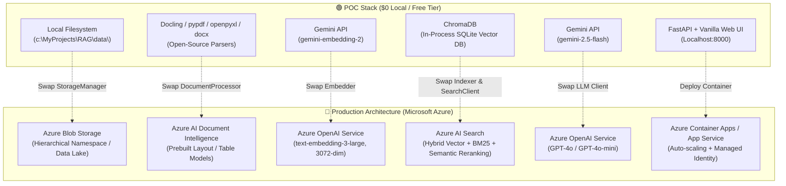

# Production Migration Guide: Graduating to Microsoft Azure

This guide details how to transition this Proof of Concept (POC) from the local Gemini stack into an enterprise-grade, highly scalable production architecture on **Microsoft Azure**.

The codebase was deliberately designed using **decoupled interfaces and single-responsibility classes** so that each local component maps 1:1 to an Azure enterprise cloud service.

---

## 1. Architectural Evolution



---

## 2. Component-by-Component Migration Matrix

| Architectural Layer | 🟢 Current POC Implementation | 🔵 Azure Production Target | Code Impact / File Changed |
|:---|:---|:---|:---|
| **Document Storage** | Local Disk (`data/documents/`) via `file_manager.py` | **Azure Blob Storage** (`azure-storage-blob`) | Replace local file I/O in [file_manager.py](file:///c:/MyProjects/RAG/src/ingestion/file_manager.py) with `BlobClient` |
| **Document Processing** | `docling` + `pypdf` + `python-docx` + `openpyxl` | **Azure AI Document Intelligence** (`azure-ai-documentintelligence`) | Replace parsing in [document_processor.py](file:///c:/MyProjects/RAG/src/ingestion/document_processor.py) with `analyze_document` |
| **Embeddings** | Gemini `gemini-embedding-2` (3072-dim) via `embedder.py` | **Azure OpenAI** `text-embedding-3-large` (3072-dim) | Update client in [embedder.py](file:///c:/MyProjects/RAG/src/ingestion/embedder.py) to `AzureOpenAI` |
| **Vector Index & Search** | Local ChromaDB via `indexer.py` & `search_client.py` | **Azure AI Search** (`azure-search-documents`) | Replace ChromaDB in [indexer.py](file:///c:/MyProjects/RAG/src/ingestion/indexer.py) and [search_client.py](file:///c:/MyProjects/RAG/src/retrieval/search_client.py) |
| **LLM Generation** | Gemini `gemini-2.5-flash` via `query_engine.py` | **Azure OpenAI** GPT-4o / GPT-4o-mini | Update `client.chat.completions` in [query_engine.py](file:///c:/MyProjects/RAG/src/retrieval/query_engine.py) |
| **App Hosting** | Local Uvicorn server | **Azure Container Apps** or **App Service** | Add `Dockerfile` and GitHub Actions deploy workflow |
| **Identity & Security** | `.env` API keys | **Azure Managed Identities** + **Key Vault** | Use `DefaultAzureCredential` from `azure-identity` |

---

## 3. Step-by-Step Implementation

### Step 1: Storage Layer — Swap to Azure Blob Storage
In production, documents are uploaded directly into an Azure Storage container.

```python
# Production implementation in src/ingestion/file_manager.py
from azure.identity import DefaultAzureCredential
from azure.storage.blob import BlobServiceClient

class AzureBlobFileManager:
    def __init__(self, account_url: str, container_name: str):
        credential = DefaultAzureCredential()
        self.client = BlobServiceClient(account_url=account_url, credential=credential)
        self.container = self.client.get_container_client(container_name)

    def scan_documents(self):
        return [
            FileInfo(name=blob.name, size_bytes=blob.size, modified_at=blob.last_modified.isoformat())
            for blob in self.container.list_blobs()
        ]

    def download_to_temp(self, blob_name: str, target_path: str):
        blob_client = self.container.get_blob_client(blob_name)
        with open(target_path, "wb") as f:
            f.write(blob_client.download_blob().readall())
```

### Step 2: Extraction Layer — Azure AI Document Intelligence
Replaces Docling, pypdf, openpyxl, and OCR with Microsoft's cloud layout models.

```python
# Production implementation in src/ingestion/document_processor.py
from azure.ai.documentintelligence import DocumentIntelligenceClient
from azure.ai.documentintelligence.models import AnalyzeDocumentRequest
from azure.identity import DefaultAzureCredential

class AzureDocumentProcessor:
    def __init__(self, endpoint: str):
        self.client = DocumentIntelligenceClient(
            endpoint=endpoint, 
            credential=DefaultAzureCredential()
        )

    def process(self, file_path: str) -> ProcessedDocument:
        with open(file_path, "rb") as f:
            poller = self.client.begin_analyze_document(
                "prebuilt-layout",
                AnalyzeDocumentRequest(bytes_source=f.read()),
                output_content_format="markdown"  # Native Markdown output!
            )
            result = poller.result()

        return ProcessedDocument(
            source_file=file_path,
            file_name=Path(file_path).name,
            document_type=Path(file_path).suffix,
            content_markdown=result.content,
            page_count=len(result.pages)
        )
```

### Step 3: Vector Store — Azure AI Search (Hybrid + Semantic Reranker)
While ChromaDB provides basic vector similarity search, Azure AI Search delivers:
1. **Full-text search (BM25)** for exact keyword matching (SKUs, IDs, names).
2. **Dense vector search** (HNSW) for conceptual understanding.
3. **Semantic Reranking** (powered by Bing models) that re-scores top candidates for superior precision.

```python
# Production implementation in src/retrieval/search_client.py
from azure.identity import DefaultAzureCredential
from azure.search.documents import SearchClient
from azure.search.documents.models import VectorizedQuery

class AzureAISearchClient:
    def __init__(self, endpoint: str, index_name: str, embedder):
        self.client = SearchClient(
            endpoint=endpoint,
            index_name=index_name,
            credential=DefaultAzureCredential()
        )
        self.embedder = embedder

    def search(self, query: str, top_k: int = 5):
        query_vector = self.embedder.embed_query(query)
        vector_query = VectorizedQuery(
            vector=query_vector, 
            k_nearest_neighbors_count=top_k, 
            fields="content_vector"
        )

        results = self.client.search(
            search_text=query,                  # BM25 Keyword Search
            vector_queries=[vector_query],      # Dense Vector Search
            query_type="semantic",              # Microsoft Semantic Reranker
            semantic_configuration_name="default",
            top=top_k
        )
        return list(results)
```

### Step 4: LLM & Embeddings — Azure OpenAI Service
Configure the official `openai` SDK pointing to Azure deployments:

```python
from openai import AzureOpenAI
from azure.identity import DefaultAzureCredential, get_bearer_token_provider

token_provider = get_bearer_token_provider(
    DefaultAzureCredential(), "https://cognitiveservices.azure.com/.default"
)

client = AzureOpenAI(
    azure_endpoint="https://<your-resource>.openai.azure.com/",
    azure_ad_token_provider=token_provider,
    api_version="2024-06-01"
)

# Embeddings: text-embedding-3-large (3072-dimensions matching gemini-embedding-2)
response = client.embeddings.create(
    input="Sample text chunk",
    model="text-embedding-3-large"
)
vector = response.data[0].embedding

# Generation: gpt-4o
completion = client.chat.completions.create(
    model="gpt-4o",
    messages=[
        {"role": "system", "content": SYSTEM_PROMPT},
        {"role": "user", "content": prompt}
    ],
    temperature=0.2
)
```

---

## 4. Containerization & Cloud Deployment

Create a `Dockerfile` in the root of the project:

```dockerfile
FROM python:3.11-slim

WORKDIR /app

# Install build dependencies & OCR utilities
RUN apt-get update && apt-get install -y --no-install-recommends \
    build-essential \
    tesseract-ocr \
    && rm -rf /var/lib/apt/lists/*

COPY pyproject.toml .
RUN pip install --no-cache-dir .

COPY . .

EXPOSE 8000

CMD ["uvicorn", "src.api.main:app", "--host", "0.0.0.0", "--port", "8000"]
```

Deploy with Azure CLI:
```bash
# Build & deploy to Azure Container Apps
az containerapp up \
    --name rag-production \
    --resource-group rg-rag-prod \
    --location eastus \
    --ingress external \
    --target-port 8000 \
    --source .
```

---

## 5. Security & Enterprise Compliance

1. **Zero Secret Footprint**: Use `DefaultAzureCredential` (Managed Identity) across all Azure services. No API keys stored in source code or `.env` files.
2. **Data Encryption**: All document storage in Azure Blob is encrypted with customer-managed keys (CMK) via Azure Key Vault.
3. **Network Isolation**: All service-to-service communication (Container App $\leftrightarrow$ Azure AI Search $\leftrightarrow$ Azure OpenAI $\leftrightarrow$ Blob Storage) can be routed over private endpoints (Private Link) with public network access disabled.
